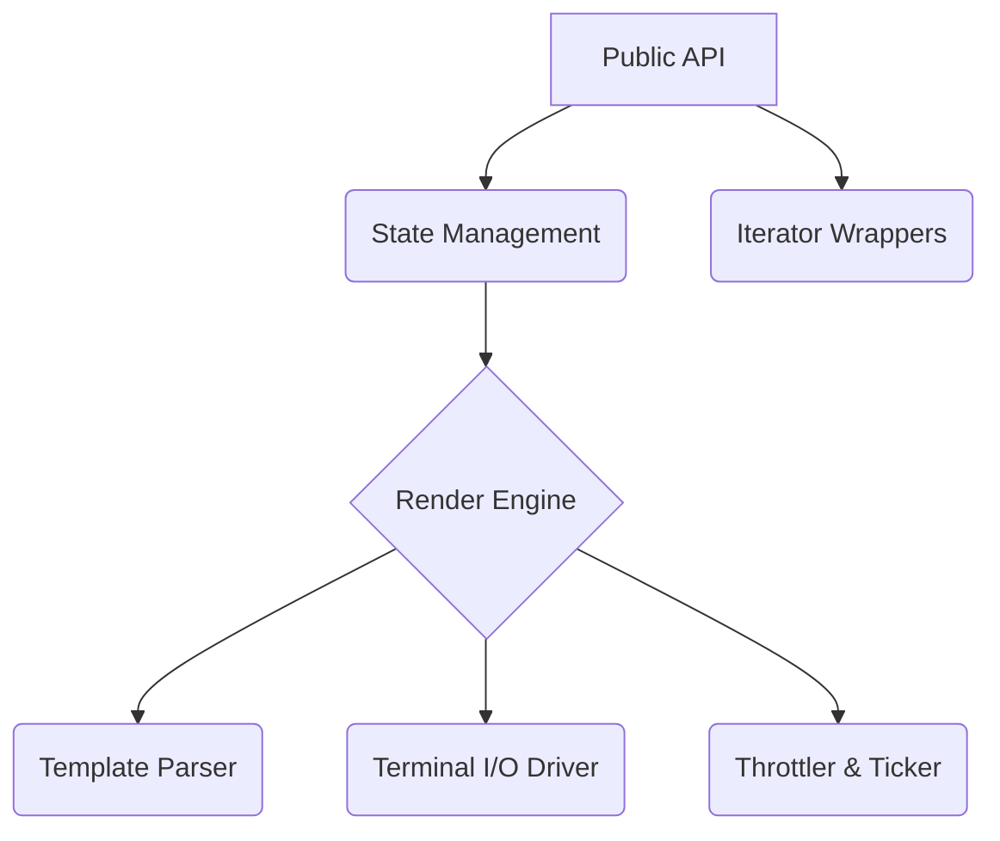

# MoonBit 进度条库设计方案 (moon-progress)

结合 `indicatif` (灵活的模板与多进度条)、`tqdm` (极致的易用性与智能 ETA) 和 `charmbracelet/bubbles` (函数式响应架构) 的优点，为 MoonBit 规划一个优雅、高性能、现代化的 CLI 进度条库。

## 1. 核心设计理念

1. **开发者友好 (tqdm-like)**: 提供极简的 API，开箱即用，通过简单的打包或迭代即可使用。
2. **极度灵活 (indicatif-like)**: 提供强大的模板机制，允许用户自定义几乎所有视觉元素。
3. **函数式与多路复用 (charm-like)**: 采用无副作用的状态更新逻辑，并支持底层安全的多进度条渲染。
4. **高性能**: 低开销的终端 I/O 控制和智能的渲染节流降级(Throttling)。

## 2. 核心架构分层



1. **State Management (状态绑定层)**: 维护进度、速度、时间、预估信息等状态，采用不可变或受控可变模式。
2. **Template Parser (模板引擎层)**: 解析类似于 `{spinner} [{bar}] {pos}/{len} ({eta})` 的字符串。
3. **Terminal I/O Driver (终端驱动层)**: 处理 ANSI 转义码，负责光标的移动、隐藏、恢复，以及多行进度条的重绘。
4. **Render Engine & Throttler (渲染引擎与节流器)**: 控制渲染频率（如 15FPS），避免过于密集的 I/O 操作拖慢主程序。

## 3. 详细需求与功能模块设计

### 3.1 极简的快速起步 API

为了提供极简的体验，对于一些迭代操作，应当能够方便地挂载进度条。在 MoonBit 中，可以提供一个接收 `Iter[T]` 返回 `Iter[T]` 的扩展方法或者包裹函数：

```moonbit
//| 概念设计
let pbar = ProgressBar::new(100)
for i in pbar.wrap_iter((0..<100).iter()) {
    // 进度条会随着迭代自动增加
    do_work(i)
}
```

此外，对于流式 I/O (例如下载文件或上面的 `fzip` 库)，支持手动步进：

```moonbit
let pb = ProgressBar::new(1024 * 1024)
pb.set_style(Style::default().template("{bytes}/{total_bytes} [{bar}] {eta}"))
while !stream.is_eof() {
    let chunk = stream.read(4096)
    pb.inc(chunk.length())
}
pb.finish_with_message("Download complete!")
```

### 3.2 强大的样式与模板系统 (Style & Template)

参考 `indicatif`，进度条的视觉表现应当与状态机分离。由 `Style` 结构体来定义进度条长什么样。

**支持的 Token**:

- `{bar}`: 实际的进度条区域（如 `████░░░░` 或 `[=>   ]`）。
- `{spinner}`: 旋转指示器（如 `⠋⠙⠹⠸⠼⠴⠦⠧⠇⠏` 等动画字符）。
- `{pos}`: 当前进度值。
- `{len}`: 总大小。
- `{bytes}` / `{total_bytes}`: 以易读格式显示的大小（如 `1.5 MB`）。
- `{percent}`: 百分比（如 `45%`）。
- `{elapsed}` / `{elapsed_precise}`: 已经流逝的时间（如 `12s` 或 `00:00:12`）。
- `{eta}` / `{eta_precise}`: 剩余时间预估。
- `{msg}`: 用户自定义的附加上下文信息。

**预设样式集**:
库应该提供几套内置的样式风格：

- **ASCII**: `[===========>.........]` (最大兼容性)
- **Blocks**: `███████████░░░░░░░░░░` (美观)
- **Dots**: `⣿⣿⣿⣿⣿⣿⣀⣀⣀⣀⣀⣀⣀⣀` (Braille patterns)

### 3.3 多进度条支持 (MultiProgress)

当存在并行的多个任务时，多进度条的渲染是 CLI 工具的难点。库必须处理终端的重绘和光标回退逻辑。

```moonbit
let m = MultiProgress::new()
let pb1 = m.add(ProgressBar::new(100))
let pb2 = m.add(ProgressBar::new(200))

// 并发/交替更新 pb1 和 pb2
// m 会在后台或拦截器中接管实际的终端 stdout 输出，保证不串行
```

### 3.4 智能 ETA（剩余时间）算法

引入基于 **指数移动平均 (Exponential Moving Average, EMA)** 的速率和时间预估引擎：
由于任务速度可能波动很大（例如解压小文件和大文件交替），直接用 `总时间/总进度` 会非常不准，只看最近一秒又太敏感。EMA 能保证 ETA 计算平滑且及时响应变化。

### 3.5 终端降级与日志集成 (Log Integration)

**问题**：如果在展示进度条时，程序通过 `println()` 输出了普通日志，进度条会被日志冲毁或者导致多条残影。
**设计方案**：
引入一种挂起机制。如果用户需要在进度条显示期间打印日志，可以调用挂起函数：

```moonbit
pb.suspend(fn() {
    println!("Found a warning at line 42")
})
```

底层实现上，`suspend` 会先发送清除当前进度条的 ANSI 码（`\x1b[2K\r`），执行用户的打印，然后再重新绘制进度条。或者提供一个 `pb.println(msg)` 代理方法。

### 3.6 隐藏终端光标 (Cursor Management)

- **启动时**：发送 `\x1b[?25l` 隐藏控制台的闪烁光标，因为不断刷新的进度条旁边带着个光标会极其难看。
- **结束时/清理时**：发送 `\x1b[?25h` 恢复控制台光标。
- **异常安全 (Panic Safety)**: 甚至需要注册全局退出钩子，如果在带进度条的过程中程序崩溃 (panic)，必须保证能恢复光标，否则用户的终端就“坏”了。目前对于 MoonBit，可以考虑在 `ProgressBar` 对象的隐式资源释放中或确保开发者主动调用 `finish()`。

### 3.7 性能与降频机制 (Throttling)

频繁的终端 `stdout` 刷新很容易成为性能瓶颈（这在快速解压如 fzip 时非常常见）。

- 进度条内部维护一个 `last_draw_time`。
- 设定默认刷新率 `15 Hz` 或 `10 Hz`。
- 调用 `pb.inc(1)` 上万次，只会在超过刷新时间间隔且状态确实变化时才触发一次终端字符串拼接和 I/O 写出。

## 4. 关键接口草图 (MoonBit 伪代码)

```moonbit
//| 进度条主类型
pub struct ProgressBar {
  mut pos : UInt64
  len : UInt64
  // 其他 private 内部状态
}

//| 样式类型
pub struct ProgressStyle {
  // ...
}

//| 工厂模式与构造器
pub fn ProgressBar::new(len : UInt64) -> ProgressBar {
  // ...
}

//|
pub fn ProgressBar::hidden() -> ProgressBar {
  // ...
}

//| 状态更新 API
pub fn inc(self : ProgressBar, delta : UInt64) -> Unit {
  self.pos += delta
  // 触发重绘逻辑
}

//|
pub fn set_position(self : ProgressBar, pos : UInt64) -> Unit {
  self.pos = pos
}

//|
pub fn set_message(self : ProgressBar, msg : String) -> Unit {
  // ...
}

//| 生命周期 API
pub fn finish(self : ProgressBar) -> Unit {
  // ...
}

//|
pub fn finish_with_message(self : ProgressBar, msg : String) -> Unit {
  // ...
}

//|
pub fn abandon(self : ProgressBar) -> Unit {
  // ...
} // 中止，并不再停留在 100%

//| 样式设定
pub fn set_style(self : ProgressBar, style : ProgressStyle) -> Unit {
  // ...
}

//| 日志打印防冲突
pub fn println(self : ProgressBar, msg : String) -> Unit {
  // ...
}

//|
pub fn ProgressStyle::default_bar() -> ProgressStyle {
  // ...
}

//|
pub fn ProgressStyle::default_spinner() -> ProgressStyle {
  // ...
}

//|
pub fn template(self : ProgressStyle, tmpl : String) -> ProgressStyle {
  // ...
  self
}

//|
pub fn progress_chars(self : ProgressStyle, chars : String) -> ProgressStyle {
  // 设置 "█░" 类似块
  // ...
  self
}
```

## 5. 项目路线图 (Roadmap)

- **Phase 1 (MVP)**:
  - 单一进度条的核心模型与基本迭代 API。
  - 纯文本终端重绘逻辑 (`\r` 和 清除行)。
  - 基本样式支持和固定速率控制。
- **Phase 2**:
  - 引入字符串模板引擎 `{bytes}`, `{eta}`, `{bar}` 解析。
  - 智能 ETA (EMA 算法) 计算引擎。
  - 隐式/显式的光标管理、`pb.println()` 防冲突设计。
- **Phase 3**:
  - 完整的 `MultiProgress` 并发多条渲染支持（这需要在终端使用绝对和相对的光标移动命令 `\x1b[nA`）。
  - Spinner（无限进度动画），对应大小未知的任务。

## 6. 与 fzip 的结合展望

按照 fzip 的 CLI PRD:

1. 在大文件（>10MB）压缩解压时，fzip 可以直接使用此库展示进度条（例如 `Downloading... [████░░░░] 50% (5MB/10MB)`）。
2. 在处理含有大量小文件的目录压缩时，可以通过 `pb.set_message("Compressing project/src/main.mbt")` 动态更新当前处理卡顿的条目，给用户优异的反馈。
3. 如果 fzip 采取并行处理（如未来特性中规划的并行解压），`MultiProgress` 可以轻松派上用场。
